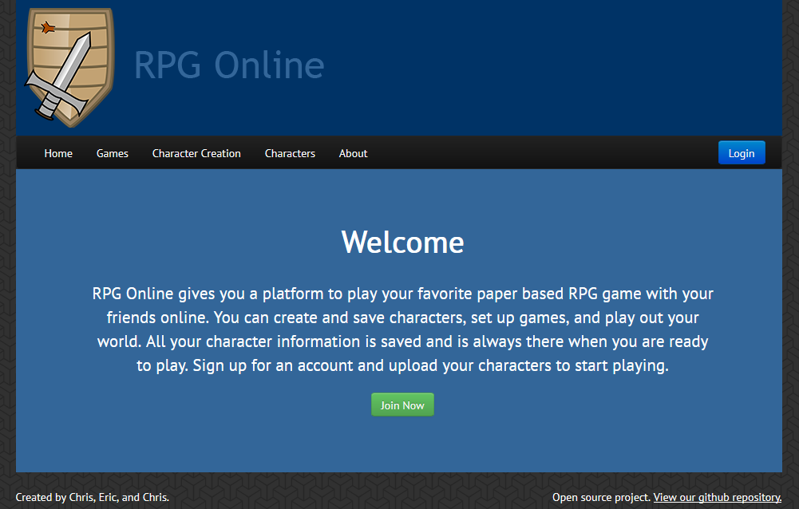
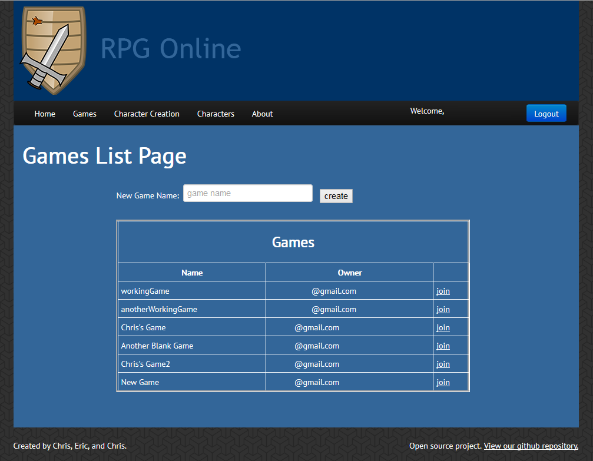
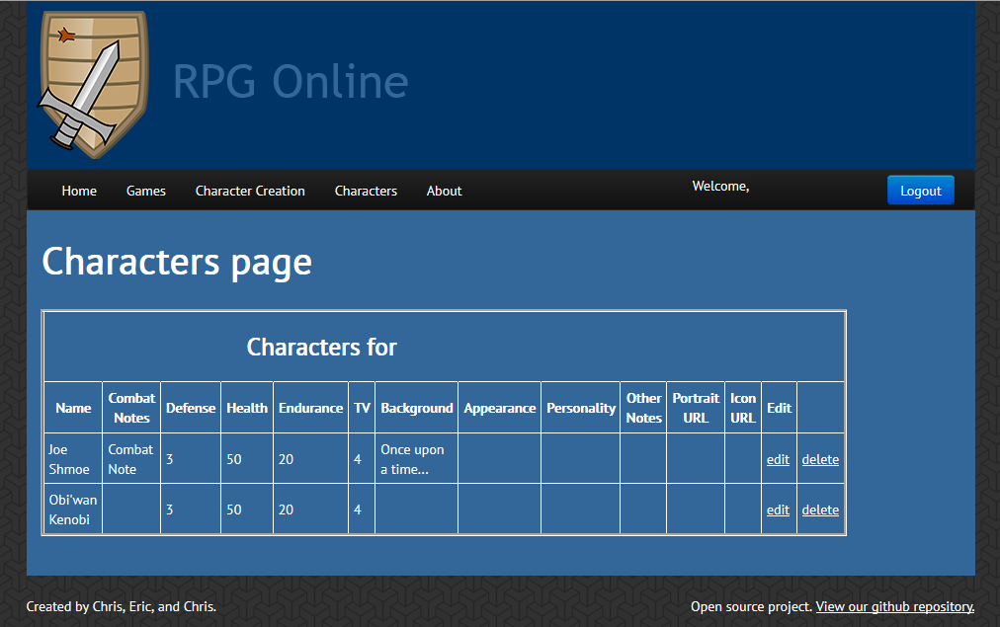
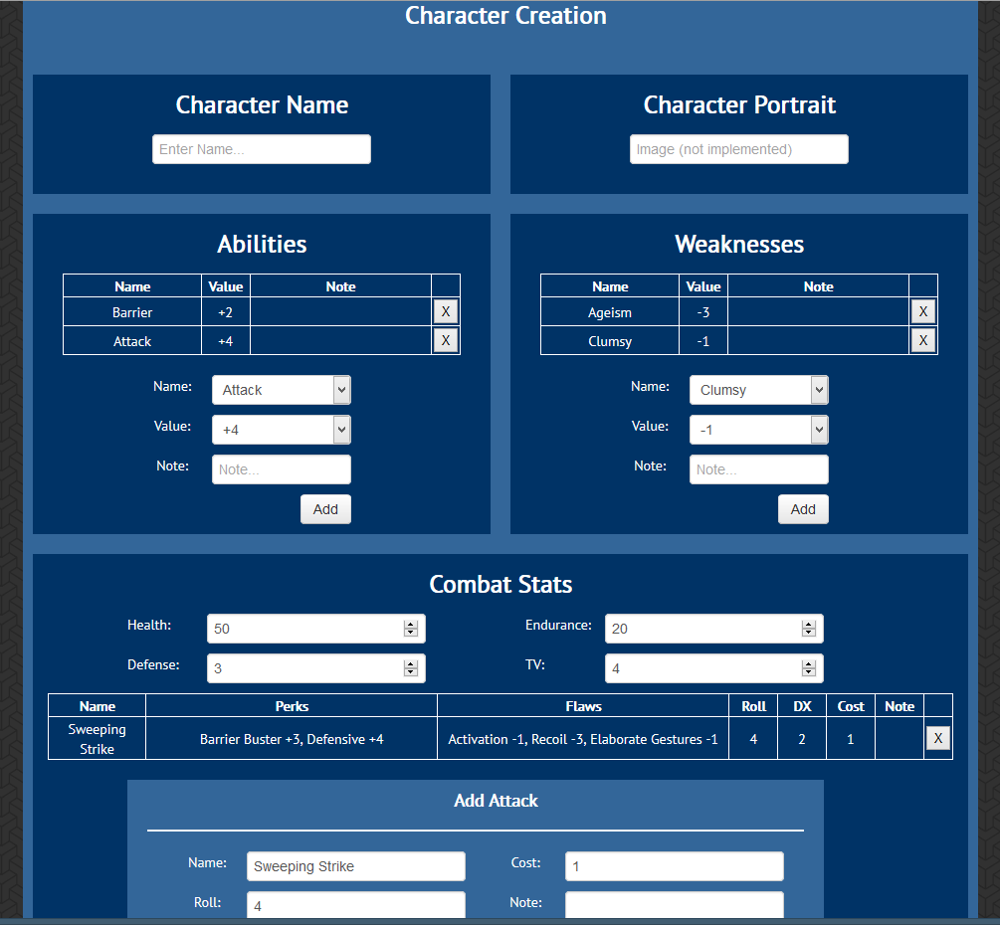

TextRPGOnline
=============

Tools for hosing a text based RPG Online

Frontend Site
=============

The home page is a welcome screen that explains the site and directs the user to login and create an account.
Both the login button in the top right and the join now button take you to the same place.

Games can be view and joined without logging in. However without logging in you will only have view rights to
the games and characters in each game.

In order to view your characters you must be logged in. If you aren't logged in you will be directed to login.
Here you can see all the characters for your username and delete or edit any of them.

This page is only accessible if you are logged in. Once logged in you can create a new character. Once you add
all the attributes you want and you submit the character you will be redirected to the characters page where
your new character will show up.

